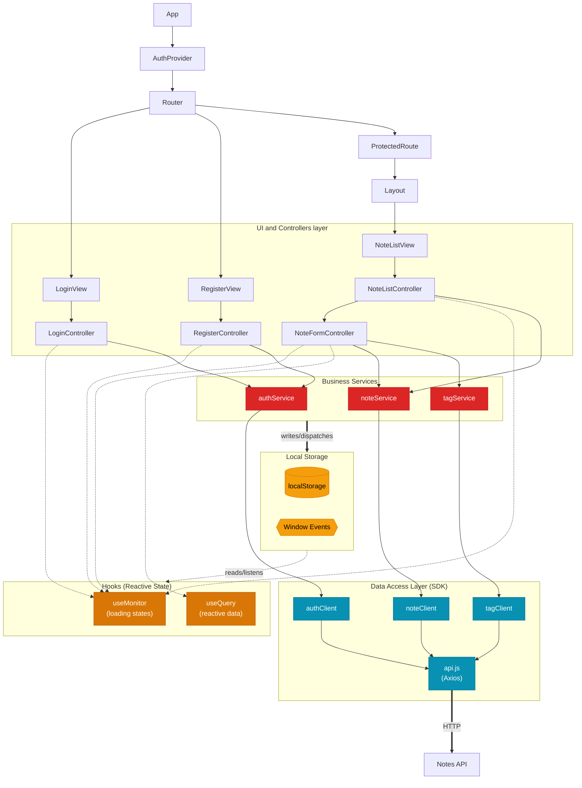

```mermaid
    graph TB
        App["App"] --> AuthProvider["AuthProvider"]
        AuthProvider --> Router["Router"]

        Router --> LoginView["LoginView"]
        Router --> RegisterView["RegisterView"]
        Router --> ProtectedRoute["ProtectedRoute"]
        ProtectedRoute --> Layout["Layout"]
        Layout --> NoteListView["NoteListView"]

        subgraph UI_Logic["UI and Controllers layer"]
            LoginView --> LoginController
            RegisterView --> RegisterController
            NoteListView --> NoteListController
            NoteListController --> NoteFormController
        end

        subgraph Hooks["Hooks (Reactive State)"]
            useMonitor["useMonitor\n(loading states)"]
            useQuery["useQuery\n(reactive data)"]
        end

        subgraph Services["Business Services"]
            authService
            noteService
            tagService
        end

        LoginController -.-> useMonitor
        LoginController --> authService
        
        RegisterController -.-> useMonitor
        RegisterController --> authService

        NoteListController -.-> useMonitor
        NoteListController --> noteService

        NoteFormController -.-> useMonitor
        NoteFormController -.-> useQuery
        NoteFormController --> noteService
        NoteFormController --> tagService

        subgraph SDK["Data Access Layer (SDK)"]
            authClient --> API["api.js\n(Axios)"]
            noteClient --> API
            tagClient --> API
        end

        subgraph Storage["Local Storage"]
            localStorage[("localStorage")]
            events{{"Window Events"}}
        end

        authService ---> authClient
        noteService ---> noteClient
        tagService ---> tagClient

        Services ==>|"writes/dispatches"| Storage
        Storage -.->|"reads/listens"| Hooks
        
        API ===>|"HTTP"| Cloud["Notes API"]

        classDef hook fill:#d97706,stroke:#b45309,color:#fff
        classDef service fill:#dc2626,stroke:#b91c1c,color:#fff
        classDef sdk fill:#0891b2,stroke:#0e7490,color:#fff
        classDef storage fill:#f59e0b,stroke:#d97706,color:#000
        class useMonitor,useQuery hook
        class authService,noteService,tagService service
        class authClient,noteClient,tagClient,API sdk
        class localStorage,events storage
```